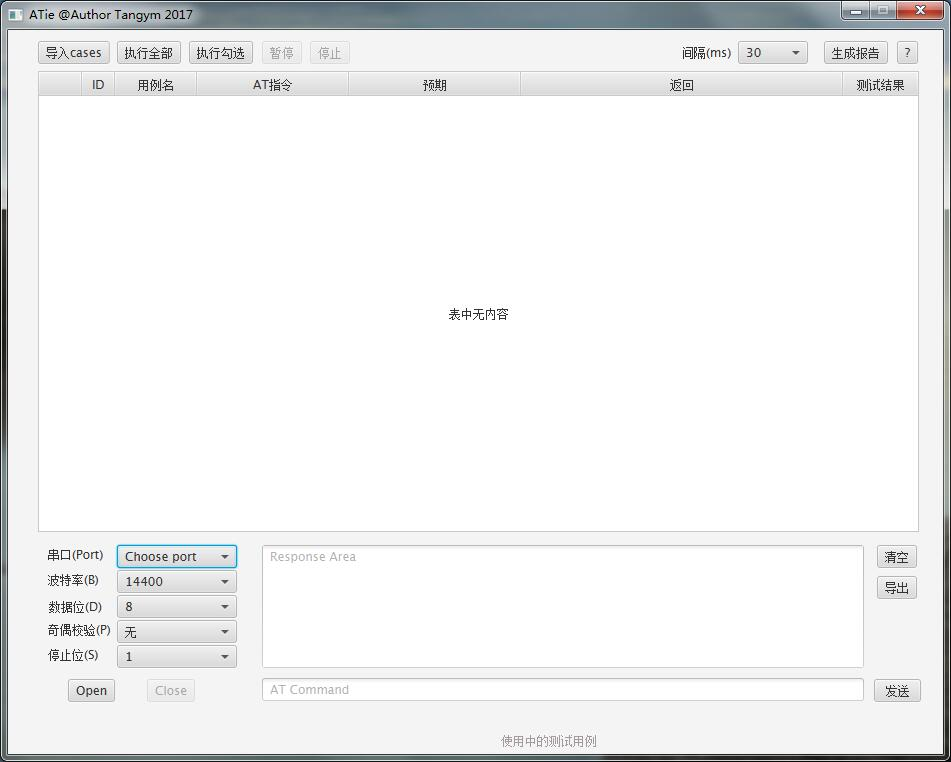
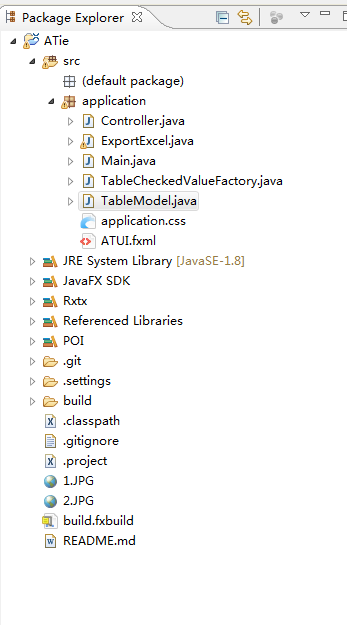

#ATie文档
- - -



##javafx环境准备：
###选择一：配置你的eclipse 
跟着此[教程](http://www.javafxchina.net/blog/2015/09/efxclipse-1-adding_efxclipse_to_eclipse/)一步步来。
###选择二:下载javafx all in one：
[下载地址](http://efxclipse.bestsolution.at/install.html#all-in-one)

##添加以下jar包：
```
RXTXcomm.jar 关于RXTXcomm的使用[参考教程](http://blog.csdn.net/cheng157507947/article/details/43764623)
commons-codec-1.10.jar
poi-scratchpad-3.15.jar
poi-excelant-3.15.jar
log4j-1.2.17.jar
poi-3.15.jar
commons-logging-1.2.jar
xmlbeans-2.6.0.jar
poi-ooxml-schemas-3.15.jar
poi-ooxml-3.15.jar
commons-collections4-4.1.jar
junit-4.12.jar
curvesapi-1.04.jar
poi-examples-3.15.jar
```

#结构：
项目结构如下

